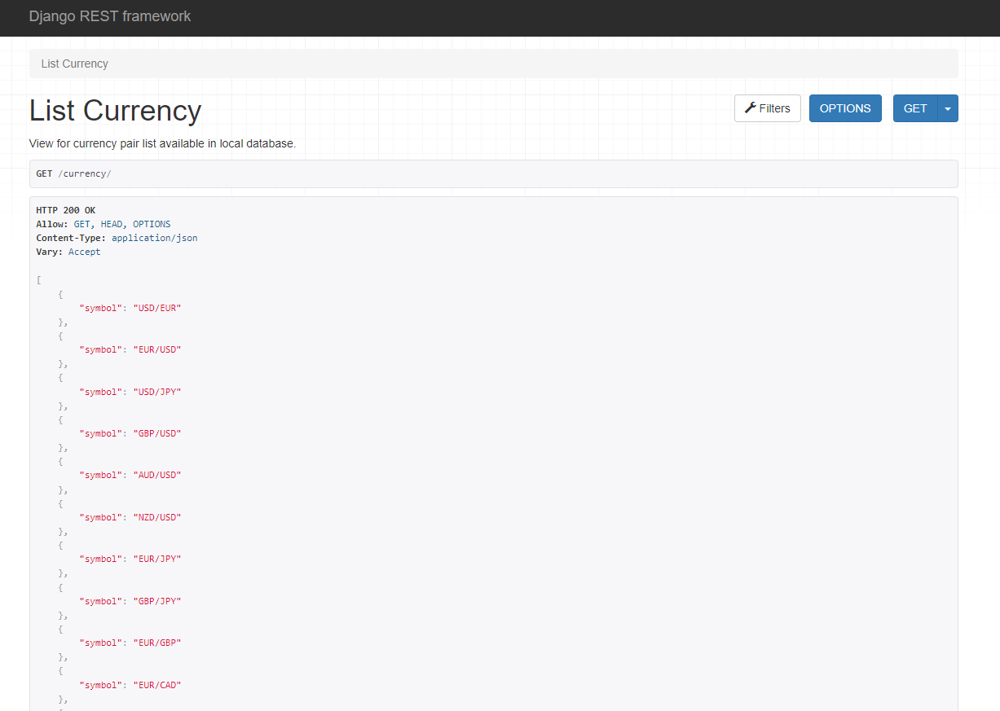
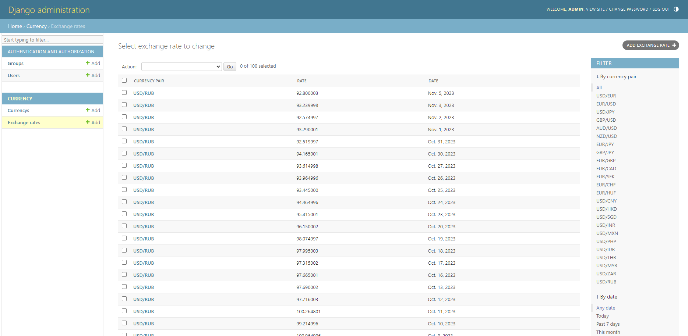

# django-task
Simple Django REST aplication to list currency pair and historical rates in admin site.


## Build and run
### Docker
```bash
docker build -t currency_app .
```
```bash
docker run -it -p 8080:8080 currency_app
```
### Python
```bash
pip install -r requirements.txt
```
```bash
python manage.py runserver 0.0.0.0:8080
```

## API specification
After run app is available adress `localhost:8080`
### GET `/currency` 
Get all currency pair from database


```json
[
    {
        "symbol": "USD/EUR"
    },
    {
        "symbol": "EUR/USD"
    },
    {
        "symbol": "USD/JPY"
    },
    {
        "symbol": "GBP/USD"
    },
]
```

### GET `/currency/?base_currency=USD&target_currency=`
Show all base_currency pair
```json
[
    {
        "symbol": "USD/EUR"
    },
    {
        "symbol": "USD/JPY"
    },
    {
        "symbol": "USD/CNY"
    },
    {
        "symbol": "USD/HKD"
]
```

### GET `/currency/?base_currency=&target_currency=USD`
Show all target_currency pair
```json
[
    {
        "symbol": "EUR/USD"
    },
    {
        "symbol": "GBP/USD"
    },
    {
        "symbol": "AUD/USD"
    },
    {
        "symbol": "NZD/USD"
    }
]
```

### GET `/currency/?base_currency=USD&target_currency=EUR`
Show currency pair
```bash
    {
        "symbol": "USD/EUR"
    }
```

## Historical Rates
To check historical rates go to `/admin/currency/exchangerate/`. 
Login `admin` password `admin`.


## Testing
```bash
python manage.py test
```
